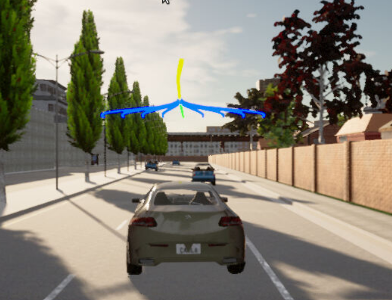
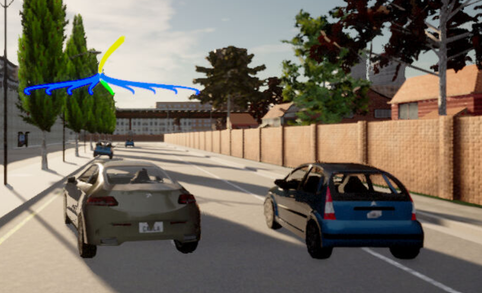
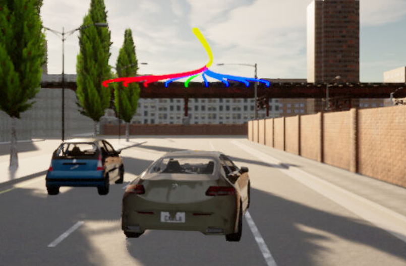
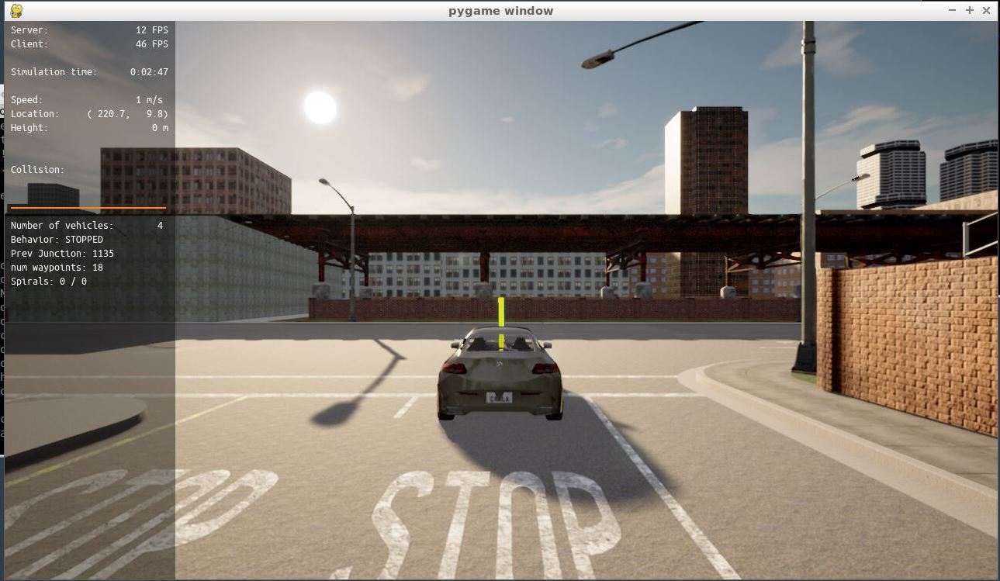

# Motion Planning and Decision Making for Autonomous Vehicles
Project of the fourth course of Udacity's "Self-Driving Car Engineer" Nanodegree Program about motion planning and decision making for automomous vehicles.  
  
## Purpose of This Repo
This repository contains the starter code including the extensions to be implemeneted as a student's task to launch in the SDC Planning course workspace and simulate the planner's behavior in
- avoiding static objects (cars, bicycles and trucks) parked on the side of the road (but still invading the lane). In this case, the ego vehicle is supposed to avoid crashing with these parking vehicles by executing either a “nudge” or a “lane change” maneuver.
- handling intersections (e.g. 3-way, 4-way intersections and roundabouts) by STOPPING at the stop line (by default).  
- tracking the centerline on the traveling lane.
  
## Project Setup Instructions
Follow the series of the commands in the workspace to launch the CARLA simulator:  

Open new terminal window:
```
su - student
// Will say permission denied, ignore and continue
cd /opt/carla-simulator/
// Launch Carla simulator
SDL_VIDEODRIVER=offscreen ./CarlaUE4.sh -opengl
```
  
## Simulation Results
Fig. 1 - 4 show some exemplary screenshots of the project's test case simulation using [CARLA](https://carla.org/). The trajectories in blue color show the potential tracks that have been evaluated. The red tracks are the ones which would lead to a collsion, and thus, cannot be taken. The green track is the actual track that has been chosen. The level of the trajectories in vertical direction shown in the screenshots is proportional to the planned velocity. When the ego vehicle decelerates the curves go down, for instance, or visce versa if the ego vehicle accelerates.  

  
  
*Fig 1: Ego vehicle follows the lane without any obstacles within the lookahead range (CARLA simulation of the project's test case).*  
  
  
  
*Fig 2: Ego vehicle avoids an obstacle (a parking car) on the right by executing a nudging maneouver to the left (CARLA simulation of the project's test case).*  
  
  
  
*Fig 3: Ego vehicle avoids an obstacle (a parking car) on the left by executing a nudging maneouver to the right (CARLA simulation of the project's test case).*  
  
  
  
*Fig 4: Ego vehicle slows down towards the stop line and finally stop. Therefore, the planned trajectories go down in vertical direction to visualize the velocity reduction (CARLA simulation of the project's test case).*  
  
## License
Remarks: Since the the code in this repository was build on the [starter code](https://github.com/udacity/nd013-c5-planning-starter) provided by Udacity, it automatically falls under the Udacity license, too:

[LICENSE.md](./LICENSE.md)

